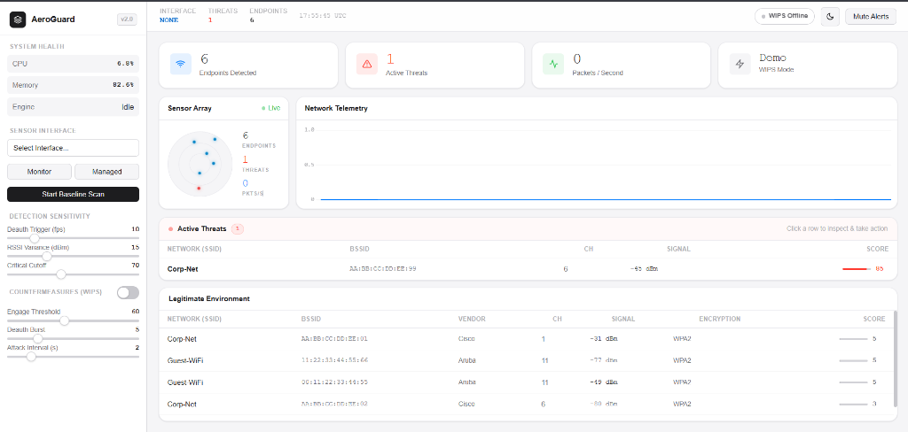
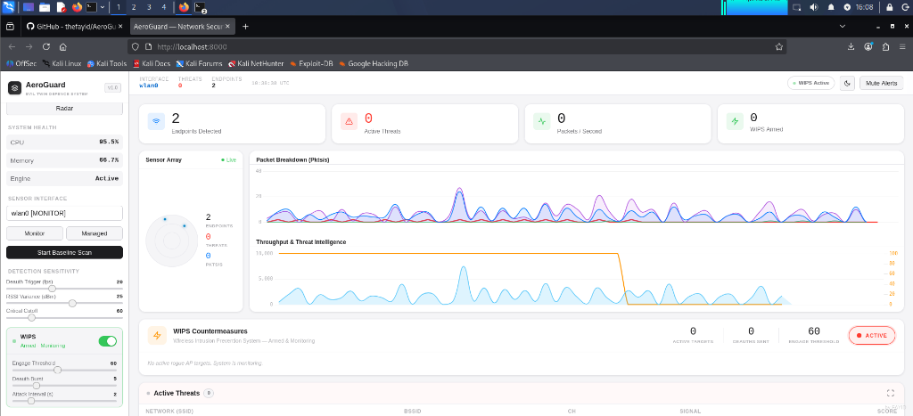
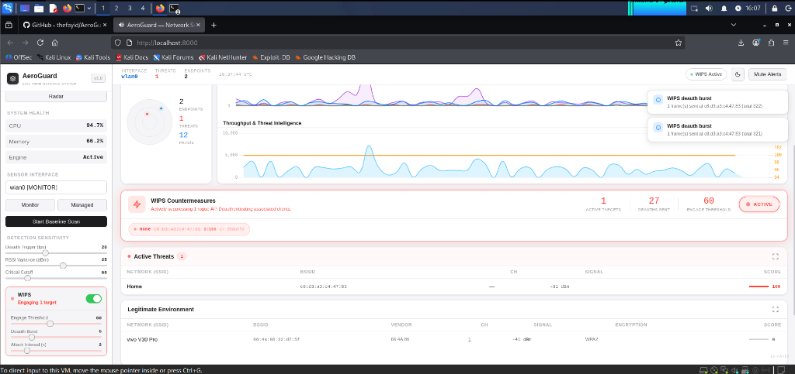

# AeroGuard WIDS

AeroGuard is an enterprise-grade Wireless Intrusion Detection and Prevention System (WIDS/WIPS). It passively monitors 802.11 wireless networks to detect advanced threats—such as Evil Twins and Deauthentication Storms—and actively defends the network using targeted countermeasures.



> [!WARNING]
> **Linux & Hardware Requirement**
> AeroGuard must be run on a **Linux** environment (e.g., Kali, Ubuntu, Debian) with a WiFi adapter that supports **Monitor Mode** and **Packet Injection** (e.g., Alfa AWUS036ACM, TP-Link TL-WN722N v1). On Windows, it operates in a restricted "Demo Mode" without injection capabilities.

---

## Features

### Threat Detection
* **Evil Twin Detection:** Identifies rogue APs via BSSID spoofing, encryption downgrades (WPA3 to WPA2/Open), PMF/802.11w stripping, and vendor OUI mismatches.
* **ML Anomaly Profiling:** Uses Scikit-Learn `IsolationForest` to profile legitimate Access Point signal strengths (RSSI) and detect sudden spatial shifts indicative of spoofing.
* **Deauthentication Storm Tracking:** Detects mass-deauth attacks (e.g., from WiFi Pineapples or `aireplay-ng`), quantifying frames and isolating attacker MAC addresses.
* **PMKID / Handshake Harvesting Detection:** Identifies brute-force EAPOL frame interception indicative of WPA2/WPA3 handshake harvesting.

### Active Countermeasures (WIPS)
* **Targeted Client Containment:** Surgically deauthenticates only the specific clients falling victim to an Evil Twin, forcing them to roam back to the legitimate network without broadcasting indiscriminate deauths.
* **Automated Engagement:** Can be configured to automatically engage rogue APs once their threat score crosses a critical threshold.
* **Manual Override:** Allows operators to manually mark/unmark targets for WIPS engagement directly from the dashboard.

### Forensics & UI
* **Automated PCAP Capture:** Automatically records and saves 30-second rolling packet captures of attack traffic when a critical threat is triggered.
* **Real-Time Dashboard:** A responsive, hardware-accelerated frontend featuring a live threat radar, network telemetry charts, dynamic scoring, and dark/light modes.

---

## Installation (Linux)

AeroGuard includes an automated installation script for Debian/Ubuntu-based systems.

### 1. Clone the Repository
```bash
git clone https://github.com/thefayid/AeroGuard-WIDS.git
cd AeroGuard-WIDS
```

### 2. Run the Installer
The script installs system dependencies (`iw`, `tcpdump`) and configures a Python virtual environment.
```bash
chmod +x install.sh
sudo ./install.sh
```

### 3. Enable Monitor Mode
Ensure your wireless interface is in monitor mode before launching. Replace `wlan0` with your interface name.
```bash
sudo ifconfig wlan0 down
sudo iwconfig wlan0 mode monitor
sudo ifconfig wlan0 up
```

---

## Usage

AeroGuard uses Scapy to sniff and inject raw 802.11 frames, requiring **root privileges**.

```bash
chmod +x run.sh
sudo ./run.sh
```

Navigate to **http://localhost:8000** in your web browser.

### First-Time Workflow
1. **Select Sensor:** Choose your monitor-mode interface from the sidebar dropdown.
2. **Baseline Scan:** Click "Start Baseline Scan". AeroGuard will profile your legitimate Access Points for 3 minutes.
3. **Monitor & Defend:** Once the baseline is established, AeroGuard actively monitors the airspace against deviations.

---

## Interface Guide


*AeroGuard in armed mode, tracking AP metrics.*


*AeroGuard actively suppressing a detected rogue AP.*

*   **Radar:** Visualizes nearby BSSIDs. Red indicates critical threats, amber indicates suspicious activity, and blue indicates legitimate networks.
*   **Target Inspection:** Click any row in the "Active Threats" table to view forensic details, compromised clients, and manual WIPS controls.
*   **WIPS Controls:** Adjust engagement thresholds, deauth burst rates, and attack intervals from the sidebar.

---

## Legal Disclaimer
*AeroGuard is designed exclusively for educational purposes and authorized auditing of networks you own or have explicit permission to test. Unauthorized interception or disruption of wireless networks is illegal in most jurisdictions. The developers assume no liability for misuse.*
